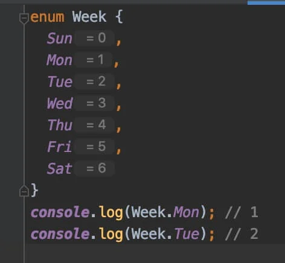
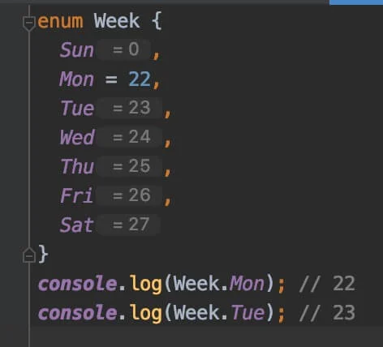
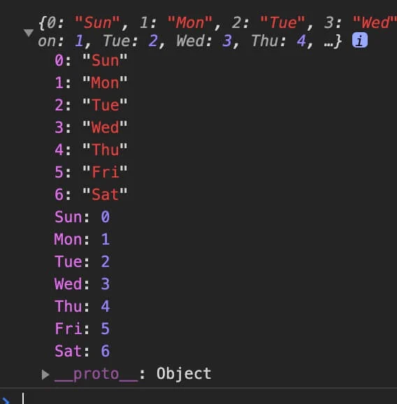

## 타입 지정

타입스크립트는 일반 변수, 매개 변수(Parameter), 객체 속성(Property) 등에 `: TYPE`과 같은 형태로 타입을 지정할 수 있습니다.

```JS
function someFunc(a: TYPE_A, b: TYPE_B): TYPE_RETURN {
  return a + b;
}
let some: TYPE_SOME = someFunc(1, 2);
```


다음 예시를 보면,

`add`함수의 매개 변수 `a`와 `b`는 `number`타입이어야 한다고 지정했고, 그렇게 실행된 함수의 반환 값은 숫자로 추론(Inference)되기 때문에 변수 `sum`도 `number`타입이어야 한다고 지정했습니다.

```js
function add(a: number, b: number) {
  return a + b;
}
const sum: number = add(1, 2);
console.log(sum); // 3
```


자바스크립트로 컴파일한 결과는 다음과 같습니다.

```js
"use strict";
function add(a, b) {
  return a + b;
}
const sum = add(1, 2);
console.log(sum);
```


## 타입 에러

만약 다음과 같이 변수를 `sum`을 `number`가 아닌 `string`타입이어야 한다고 지정했다면, 컴파일조차 하지 않고 코드를 작성하는 시점에서 에러가 발생합니다.

```js
function add(a: number, b: number) {
  return a + b;
}
const sum: string = add(1, 2);
console.log(sum);
```


위 이미지에서 TS2322라는 에러 코드를 볼 수 있으며, 이를 검색하면 쉽게 에러 코드에 대한 정보를 얻을 수 있습니다.


# 타입 선언1


## 불린 : Boolean

단순한 참(`true`)/거짓(`false`)값을 나타냅니다.

```js
let isBoolean: boolean;
let isDone: boolean = false;
```


## 숫자: Number

모든 부동 소수점 값을 사용할 수 있습니다.

ES6에 도입된 2진수 및 8진수 리터럴도 지원합니다.

```JS
let num: number;
let integer: number = 6;
let float: number = 3.14;
let hex: number = 0xf00d; // 61453
let binary: number = 0b1010; // 10
let octal: number = 0o744; // 484
let infinity: number = Infinity;
let nan: number = NaN;
```


## 문자열 : String

문자열을 나타냅니다.

작은따옴표(`'`), 큰따옴표(`"`)뿐만 아니라 ES6의 템플릿 문자열도 지원합니다.

```JS
let str: string;
let red: string = 'Red';
let green: string = "Green";
let myColor: string = `My color is ${red}.`;
let yourColor: string = 'Your color is' + green;
```


## 배열 : Array

순차적으로 값을 가지는 일반 배열을 나타냅니다.

배열은 다음과 같이 두 가지 방법으로 타입을 선언할 수 있습니다.

```js
// 문자열만 가지는 배열
let fruits: string[] = ['Apple', 'Banana', 'Mango'];
// Or
let fruits: Array<string> = ['Apple', 'Banana', 'Mango'];

// 숫자만 가지는 배열
let oneToSeven: number[] = [1, 2, 3, 4, 5, 6, 7];
// Or
let oneToSeven: Array<number> = [1, 2, 3, 4, 5, 6, 7];
```


유니언 타입(다중 타입)의 '문자열과 숫자를 동시에 가지는 배열'도 선언할 수 있습니다.

```js
let array: (string | number)[] = ['Apple', 1, 2, 'Banana', 'Mango', 3];
// Or
let array: Array<string | number> = ['Apple', 1, 2, 'Banana', 'Mango', 3];
```


배열이 가지는 항목의 값을 단언할 수 없다면 `any`를 사용할 수 있습니다.

```js
let someArr: any[] = [0, 1, {}, [], 'str', false];
```


인터페이스(Interface)나 커스텀 타입(Types)을 사용할 수도 있습니다.

```js
interface IUser {
  name: string,
  age: number,
  isValid: boolean
}
let userArr: IUser[] = [
  {
    name: 'Neo',
    age: 85,
    isValid: true
  },
  {
    name: 'Lewis',
    age: 52,
    isValid: false
  },
  {
    name: 'Evan',
    age: 36,
    isValid: true
  }
];
```


유용하진 않지만, 다음과 같이 특정한 값으로 타입을 대신해 작성할 수도 있습니다.

```js
let array = 10[];
array = [10];
array.push(10);
array.push(11); // Error - TS2345
```


읽기 전용 배열을 생성할 수도 있습니다.

`readonly`키워드나 `ReadonlyArray`타입을 사용하면 됩니다.

```js
let arrA: readonly number[] = [1, 2, 3, 4];
let arrB: ReadonlyArray<number> = [0, 9, 8, 7];

arrA[0] = 123; // Error - TS2542: Index signature in type 'readonly number[]' only permits reading.
arrA.push(123); // Error - TS2339: Property 'push' does not exist on type 'readonly number[]'.

arrB[0] = 123; // Error - TS2542: Index signature in type 'readonly number[]' only permits reading.
arrB.push(123); // Error - TS2339: Property 'push' does not exist on type 'readonly number[]'.
```


## 튜플 : Tuple

Tuple 타입은 배열과 매우 유사합니다.

차이점이라면 **정해진 타입의 고정된 길이(length) 배열**을 표현합니다.

```js
let tuple: [string, number];
tuple = ['a', 1];
tuple = ['a', 1, 2]; // Error - TS2322
tuple = [1, 'a']; // Error - TS2322
```


다음과 같이 데이터를 개별 변수로 지정하지 않고, 단일 Tuple 타입으로 지정해 사용할 수 있습니다.

```js
// Variables
let userId: number = 1234;
let userName: string = 'HEROPY';
let isValid: boolean = true;

// Tuple
let user: [number, string, boolean] = [1234, 'HEROPY', true];
console.log(user[0]); // 1234
console.log(user[1]); // 'HEROPY'
console.log(user[2]); // true
```


나아가 위 방식을 활용해 다음과 같은 Tuple 타입의 배열(2차원 배열)을 사용할 수 있습니다.

```js
let users: [number, string, boolean][];
// Or
// let users: Array<[number, string, boolean]>;

users = [[1, 'Neo', true], [2, 'Evan', false], [3, 'Lewis', true]];
```


역시 값으로 타입을 대신할 수도 있습니다.

```js
let tuple: [1, number];
tuple = [1, 2];
tuple = [1, 3];
tuple = [2, 3]; // Error - TS2322: Type '2' is not assignable to type '1'.
```


 Tuple은 정해진 타입의 고정된 길이 배열을 표현하지만, 이는 할당(Assign)에 국한됩니다.

`.push()`나 `.splice()`등을 통해 값을 넣는 행위는 막을 수 없습니다.

```js
let tuple: [string, number];
tuple = ['a', 1];
tuple = ['b', 2];
tuple.push(3);
console.log(tuple); // ['b', 2, 3];
tuple.push(true); // Error - TS2345: Argument of type 'true' is not assignable to parameter of type 'string | number'.
```


배열에서 사용한 것과 같이 `readonly`키워드를 사용해 읽기 전용 튜플을 생성할 수도 있습니다.

```js
let a: readonly [string, number] = ['Hello', 123];
a[0] = 'World'; // Error - TS2540: Cannot assign to '0' because it is a read-only property.
```


## 열거형 : Enum

Enum은 숫자 혹은 문자열 값 집합에 이름(Member)을 부여할 수 있는 타입으로, 값의 종류가 일정한 범위로 정해져 있는 경우 유용합니다.

기본적으로 `0`부터 시작하며 값은 `1`씩 증가합니다.

```js
enum Week {
  Sun,
  Mon,
  Tue,
  Wed,
  Thu,
  Fri,
  Sat
}
```




수동으로 값을 변경할 수 있으며, 값을 변경한 부분부터 다시 `1`씩 증가합니다.




Enum 타입의 재미있는 부분은 역방향 매핑(Reverse Mapping)을 지원한다는 것입니다.

이것은 열거된 멤버(`Sum`, `Mon`같은)로 값에, 값으로 멤버에 접근할 수 있다는 것을 의미합니다.

`Week`를 콘솔로 출력합니다.

```js
enum Week {
  // ...
}
console.log(Week);
console.log(Week.Sun); // 0
console.log(Week['Sun']); // 0
console.log(Week[0]); // 'Sun'
```




추가로, Enum은 숫자 값 열거뿐만아니라 다음과 같이 문자열 값으로 초기화할 수 있습니다.

이 방법은 역방향 매핑(Reverse Mapping)을 지원하지 않으며 개별적으로 초기화해야 하는 단점이 있습니다.

```js
enum Color {
  Red = 'red',
  Green = 'green',
  Blue = 'blue'
}
console.log(Color.Red); // red
console.log(Color['Green']); // green
```

```js
enum Color {
  Red = 'red',
  Green = 'green',
  Blue = 'blue'
}
console.log(Color.Red); // red
console.log(Color['Green']); // green
```


## 모든 타입 : Any

Any는 모든 타입을 의미합니다. 따라서 일반적인 자바스크립트 변수와 동일하게 어떠 타입의 값도 할당할 수 있습니다. 외부 자원을 활용해 개발할 때 불가피하게 타입을 단언할 수 없는 경우, 유용할 수 있습니다.

```js
let any: any = 123;
any = 'Hello world';
any = {};
any = null;
```


다양한 값을 포함하는 배열을 나타낼 때 사용할 수도 있습니다.

``` js
const list: any[] = [1, true, 'Anything!'];
```

강한 타입 시스템의 장점을 유지하기 위해 Any 사용을 엄격하게 금지하려면, 컴파일 옵션 `"noImplicitAny" : true`를 통해 Any사용 시 에러를 발생시킬 수 있습니다.


## 알 수 없는 타입 : Unkonown

Any와 같이 최상위 타입인 Unknown은 알 수 없는 타입을 의미합니다.

Any와 같이 Unknown에는 어떤 타입의 값도 할당할 수 있지만, Unknown을 다른 타입에는 할당할 수 없습니다.


> 일반적인 경우 Unknown은 타입 단언(Assertions)이나 타입 가드(Guards)를 필요올 합니다.
>
> 타입 단언이나 가드에 대한 내용은 다른 파트에서 정리합니다.

```js
let a: any = 123;
let u: unknown = 123;

let v1: boolean = a; // 모든 타입(any)은 어디든 할당할 수 있습니다.
let v2: number = u; // 알 수 없는 타입(unknown)은 모든 타입(any)을 제외한 다른 타입에 할당할 수 없습니다.
let v3: any = u; // OK!
let v4: number = u as number; // 타입을 단언하면 할당할 수 있습니다.
```


다양한 타입을 반환할 수 있는 API에서 유용할 수 있습니다.

> Unknown 보단 좀 더 명확한 타입을 사용하는 것이 좋습니다.

```js
type Result = {
  success: true,
  value: unknown
} | {
  success: false,
  error: Error
}

export default function getItems(user: IUser): Result {
  // Some logic...
  if (id.isValid) {
    return {
      success: true,
      value: ['Apple', 'Banana']
    };
  } else {
    return {
      success: false,
      error: new Error('Invalid user.')
    }
  }
}
```


## 객체 : Object

기본적으로 `typeof`연산자가 `"object"`로 반환하는 모든 타입을 나타냅니다.

> 컴파일러 옵션에서 엄격한 타입 검사(`strict`)를 `true`로 설정하면, `null`은 포함하지 않습니다.

```js
let obj: object = {};
let arr: object = [];
let func: object = function () {};
let nullValue: object = null;
let date: object = new Date();
// ...
```


여러 타입의 상위 타입이기 때문에 그다지 유용하지 않습니다.

보다 정확하게 타입 지정을 하기 위해 다음과 같이 객체 속성(Properties)들에 대한 타입을 개별적으로 지정할 수 있습니다.

```js
let userA: { name: string, age: number } = {
  name: 'HEROPY',
  age: 123
};

let userB: { name: string, age: number } = {
  name: 'HEROPY',
  age: false, // Error
  email: 'thesecon@gmail.com' // Error
};
```


반복적인 사용을 원하는 경우, `interface`나 `type`을 사용하는 것을 추천합니다.

```js
interface IUser {
  name: string,
  age: number
}

let userA: IUser = {
  name: 'HEROPY',
  age: 123
};

let userB: IUser = {
  name: 'HEROPY',
  age: false, // Error
  email: 'thesecon@gmail.com' // Error
};
```


## Null과 Undefined

기본적으로 Null과 Undefined는 모든 타입의 하위 타입으로, 다음과 같이 각 타입에 할당할 수 있습니다. 심지어 서로의 타입에도 할당 가능합니다.

```js
let num: number = undefined;
let str: string = null;
let obj: { a: 1, b: false } = undefined;
let arr: any[] = null;
let und: undefined = null;
let nul: null = undefined;
let voi: void = null;
// ...
```


이는 컴파일 옵션 `"strictNullChecks" : true`을 통해 엄격하게 Null과 Undefined 서로의 타입까지 더 이상 할당할 수 없게 합니다. 단, Void에는 Undefined를 할당할 수 있습니다.

```js
let voi: void = undefined; // ok
```


