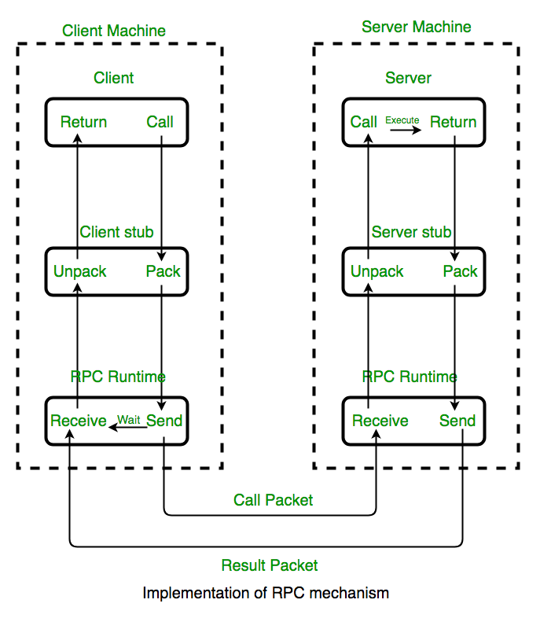
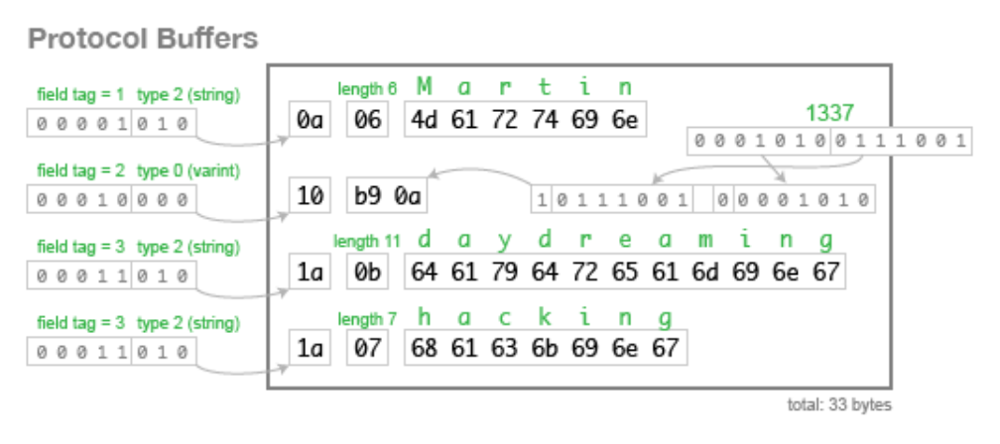

# gRPC란?
 `gRPC`는 구글에서 개발한 어디서나 실행할 수 있는 오픈소스 고성능 RPC 프레임워크입니다.
 `RPC`(Remote Procedure Call)의 줄임말로 원격 프로시저 호출이라고 합니다. 앞의 `g`는 정확한 말은 없지만 저는 google의 `g`라고 생각하고있습니다.
 
`RPC`는 별도의 원격 제어를 위한 코딩 없이 다른 주소 공간에서 함수나 프로시저를 실행할 수 있게하는 프로세스 간 통신 기술입니다. 특히 MSA(Micro Service Architecture)
구조로 서비스를 만들게 되면, 다양한 언어와 프레임워크로 개발되었을 경우에도 RPC를 이용하여 원격에 있는 프로시저를 호출하여 고유 프로그램의 개발에 집중할 수 있게 해주는 기술입니다.

또한 기존의 REST 방식의 경우에는, 표준이 없어 파라미터의 응답이 명시적이지 않았을 뿐 아니라 JSON 형태의 데이터를 Serialization하는 비용이 발생한다는 단점이 있었습니다.
RPC는 이러한 문제점까지 해결하며 사용이 많아지고 있습니다.

<br>
<br>

## Stub
`gRPC`에서 클라이언트 애플리케이션은 로컬에서 객체를 호출하듯이 서버 애플리케이션의 메서드를 직접 호출할 수 있어 분산 응용 프로그램 및 서비스를 더 쉽게 만들 수 있습니다.
이러한 기능이 `RPC`의 핵심 개념인 `Stub`입니다.

서버와 클라이언트는 다른 주소 공간을 사용하고 있으므로  함수호출에 사용되는 매개변수를 변환하는 작업이 필요합니다. 그렇지 않으면 메모리 매개 변수에 
대한 포인터가 다른 데이터를 가리키게 되기 때문입니다. 이 변환을 담당하는 기능이 `Stub`입니다.

<br>

### Marshalling, Unmarshalling
Stub은 클라이언트와 서버 각각에 존재합니다. `Client Stub`은 함수 호출에 사용될 파라미터를 변환합니다. 이를 `Marshalling`이라고 합니다. 
또한 서버에서 넘어온 결과를 변환합니다.

`Server Stub`은 클라이언트가 전달한 매개변수를 역변환합니다. 이를 `Unmarshalling` 이라고 합니다. 또한 함수 실행 결과를 변환합니다.

이러한 동작 방식이 아래의 사진과 같습니다.



<br>
<br>

## Protocol Buffer
`gRPC`는 `IDL`(Interface Definition Language)로 `Protocol Buffer`를 사용합니다. `Protocol Buffer`는 JSON, XML과 마찬가지로 직렬화 데이터 구조입니다.
`Protocol Buffer`는 다른 구조에 비해 데이터 크기가 작습니다. 

예를들어 아래의 데이터인 JSON으로 표현한다면 82byte의 크기가 사용됩니다.

```json
{ 
  "userName":"Martin",
  "favouriteNumber":1337,
  "interests":["daydreaming","hacking"] 
}
```

<br>

하지만 이를 `Protocol Buffer`로 표현한다면 33byte로 표현 가능합니다.



<br>

---

프로토콜 버퍼로 작업할 때는 `.proto`파일에서 직렬화하려는 데이터 구조를 정의합니다. `.proto`파일은 하나의 프로그래밍 언어가 아니라 여러 
프로그래밍 언어를 지원하기 때문에, 특정 언어에 종속성이 없는 형태로 데이터 타입을 정의할 때 사용합니다.

프로토콜 버퍼 데이터는 메시지로 구성됩니다. 기서 각 메시지는 필드 라고 하는 일련의 이름-값 쌍을 포함하는 정보의 작은 논리적 레코드입니다. 
다음은 간단한 예입니다.

```prototext
message Person {
  string name = 1;
  int32 id = 2;
  bool has_ponycopter = 3;
}
```
이렇게 작성된 `.proto`파일을 `protoc` 컴파일러로 컴파일 하면 데이터에 접근할 수 있는 각 언어에 맞는 형태의 데이터 클래스를 생성해줍니다.

`proto3` 언어 가이드 및 각 언어에 대해 제공되는 [문서](https://developers.google.com/protocol-buffers/docs/proto3)에서 자세한 내용을 확인
할 수 있습니다.

<br>

---
제가 작성한 `.proto` 파일의 예시입니다. `option`에서 `go_package` protoc 명령을 따르면 프로젝트 루트에 `github.com/jaden7856/go-grpcUpload`라는 
모듈 이름을 가진 proto 파일이 있습니다. 그런 다음 코드는 생성을 담당할 `streamProtoc` 폴더에 배치됩니다.

사용을 위해 source_relative의 출력 위치를 조정해야 할 수도 있지만 최소한 경로가 중복되거나 GOPATH에 코드를 다시 배치하는 데 의존하지 않아도 됩니다.

```protobuf
syntax = "proto3";

package streamProtoc;

option go_package = "github.com/jaden7856/go-grpcUpload/streamProtoc";

service UploadFileService {
  rpc Upload (stream UploadRequest) returns (UploadResponse) {}
}

message UploadRequest {
  bytes Content = 1;
  string Filename = 2;
}

enum UploadStatusCode {
  Unknown = 0;
  Ok = 1;
  Failed = 2;
}

message UploadResponse {
  string Message = 1;
  UploadStatusCode Code = 2;
}
```

<br>
<br>

## 특징

### 장점

- 높은 생산성과 다양한 언어 및 플랫폼 지원
- HTTP/2 기반의 양방향 스트리밍

<br>

### 단점

- proto 파일을 작성하기 위한 문법을 숙지 필요
- 유저와 직접적으로 소통하는 클라이언트일 경우 RPC 사용하기에 부적절 (클라이언트가 브라우저일 경우)

<br>
<br>

---

### 참고
- https://grpc.io/docs/what-is-grpc/introduction/
- https://developers.google.com/protocol-buffers/docs/overview