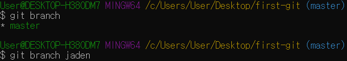
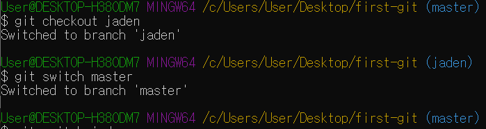
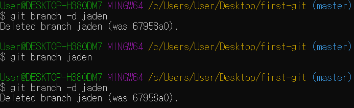

# Branch 이란?

> Software개발시 개발자들은 동일한 소스코드 위에서 신규 개발, 버그 수정 등의 업무를 협업하곤 한다. 이럴 때, 여러 개발자들이 동시에 다양한 작업을 할 수 있게 만들어 주는 기능이 "Branch" 이다.

### 1. Branch 확인 및 생성

- `git branch`
- `git branch <name>`
  - `<name>` 안에 원하는 branch 이름을 입력

### 2. Branch로 이동

- `git checkout <name>`
- `git switch <name>` : ver. 2.23 이후는 `checkout`, `switch`로도 가능하다

### 3. Branch 삭제

- `git branch -d <name>`

- `jaden` 이라는 branch를 삭제하기 위해선 그 branch에서 빠져나와 `master`에서 삭제해야 한다.