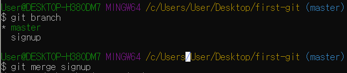

# Merge

>  다른 브랜치를 현재 Checkout된 브랜치에 Merge 하는 명령이다. Merge 하고 나서 현재 브랜치가 Merge 된 결과를 가리키도록 옮긴다.

### 1. Merge

- `git merge test` 

- `git branch test` 으로 `test` branch를 만들고 수정한 뒤에 `commit`을 하고 merge하는 사진

